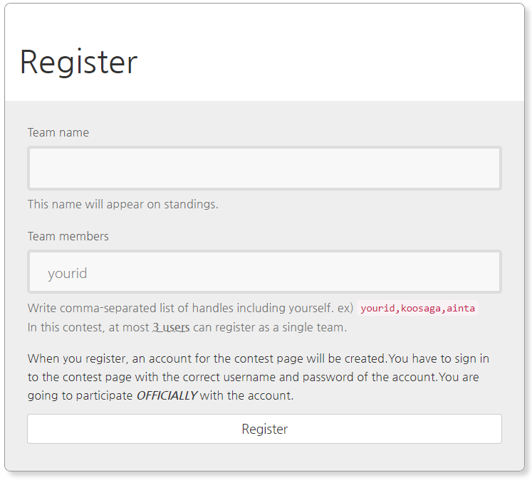
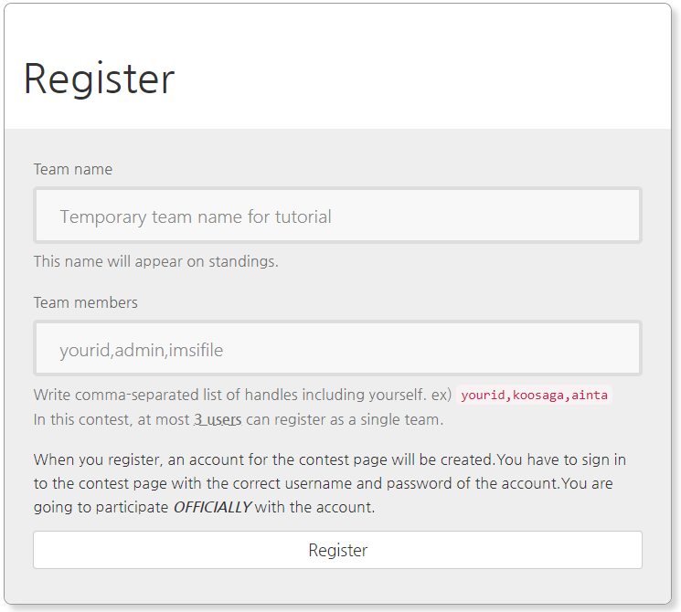
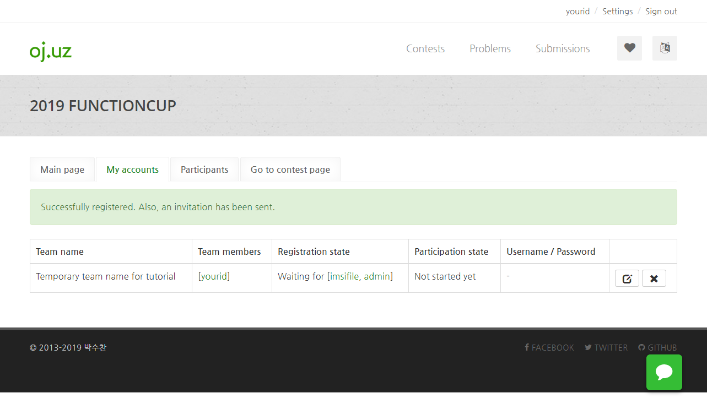
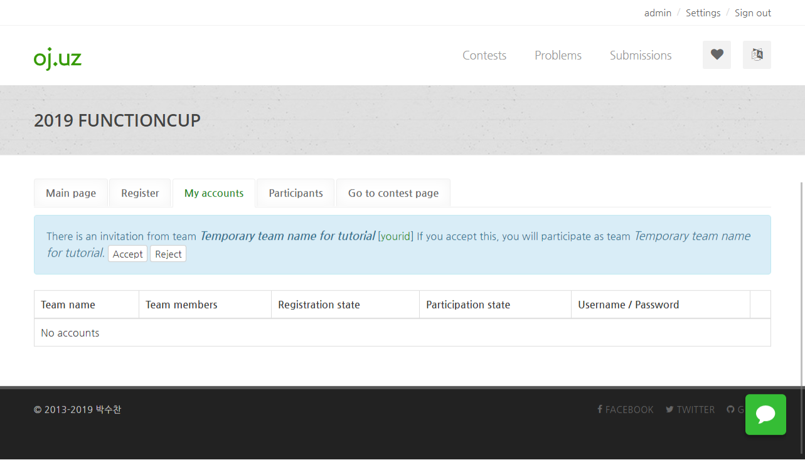
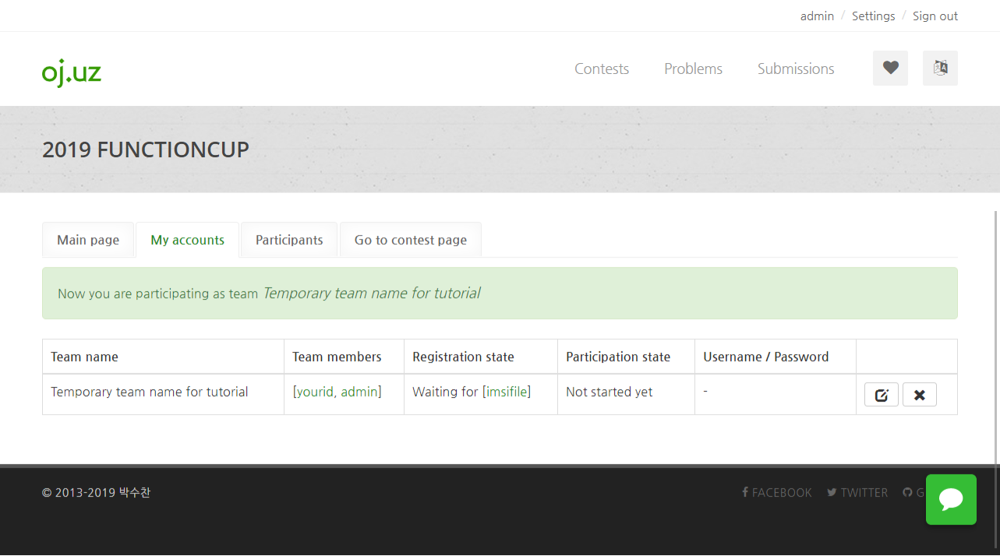

How to register in a contest
*********************************

This is a short tutorial on how to register in a contest in `oj.uz <https://oj.uz>`_ .

First, click the 'Register' tab on the contest page. Then you could see a form like this:

Write your team name and the comma-separated handles in the form. If your team only consists of you, you just need to write your own handle. (Note that your own handle is pre-written in the form)

Now click the 'register' button. If everything is okay, the server will create an account required to log in to the contest system, and then you will be redirected to the 'My accounts' tab of the contest page.

After this account is created, you are allowed to *change the team name*, but you are NOT allowed to change the team members. If you want to change your team member, you have to remove your contest account and register again. This regulation is because of security reasons.

If your team only consists of you, the registration is done. Otherwise, the other team members will get an **invitation**.

**Invitation** is a process to check whether all team members really consent to be in the team. Note that we don't send invitations by e-mail. The other team member has to sign in to oj.uz and visit the 'My accounts' tab of the same contest. This is what the other members would see if they got an invitation:

If the member 'accept's the invitation, then the member is automatically added to the team. If the member 'reject's the invitation, they are not added to the team.

The handle and password of the contest account is revealed after all registered team members 'accept' or 'reject' the invitation.

If you want to show your name or affiliation in the contest scoreboard, you can change it on the `Settings <https://oj.uz/settings/general>`_ page.
