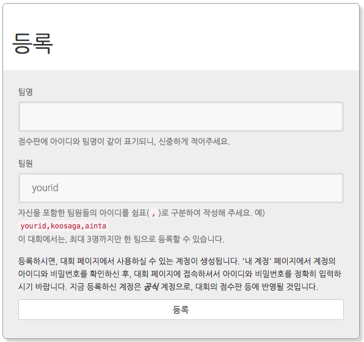
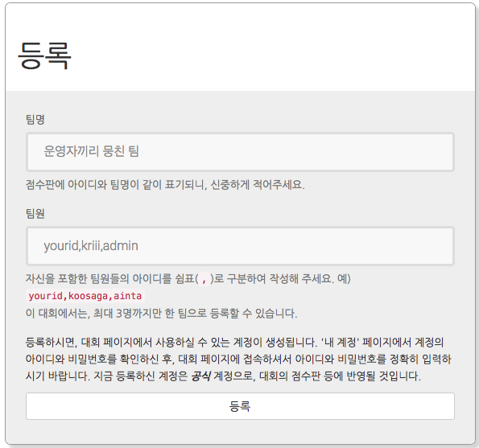
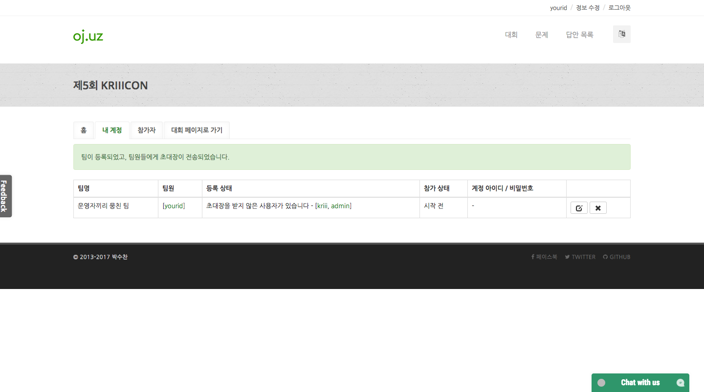
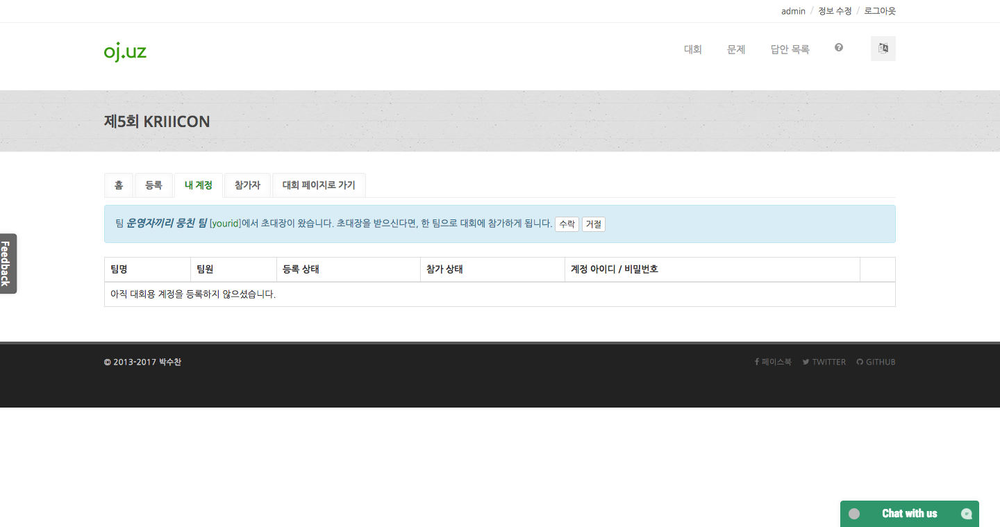
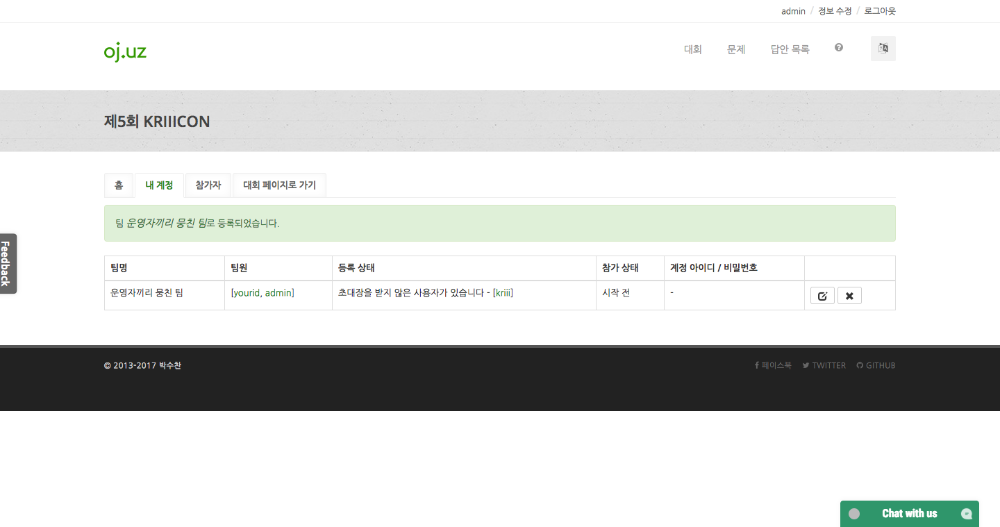

대회 참가 신청 방법
*********************************

`oj.uz <https://oj.uz>`_ 는 사이트를 이용하는 데 필요한 계정과는 독립적인 대회용 계정을 발급합니다. 일반적으로 대회에 등록하는 방법을 순서대로 정리하면 아래와 같습니다.

대회 페이지에 접속해서 '등록' 탭을 클릭합니다. 그러면 아래와 같은 화면이 나타나는데,

화면에 나타난 대로 '팀명' 칸에 팀명을, '팀원' 칸에 팀원의 아이디 목록을 입력합니다.
팀원이 자기 자신뿐이라면 자신의 아이디만 입력하면 됩니다.
(본인의 아이디는 자동으로 입력되어 있습니다.)

입력을 하셨으면 '등록' 버튼을 클릭합니다. 이상이 없다면, 아래와 같이 '내 계정' 탭으로 넘어가게 됩니다.

만약 팀원이 1명뿐인 팀을 만들었다면, 신청이 완료된 것이기 때문에 여기서 다루지 않습니다. 팀원이 2명 이상인 팀으로 신청을 했을 경우,

다음과 같이 다른 팀원들이
"**초대장**"이라는 것을 받게 됩니다.
"**초대장**"은 다른 팀원에게 여러분이 신청한 팀에 추가될지를 확인하기 위해 발송되며,
따로 메일로 보내지지는 않고 해당 팀원이 대회 페이지의 '내 계정' 탭에 접속하면 확인할 수 있습니다.

초대장을 받은 사람이 초대장을 '수락'하면 팀에 들어가게 되고, 거절하면 팀에 들어가지 않게 됩니다.

초대장을 발송한 모든 계정이 초대장을 '수락' 또는 '거절'할 때까지 계정의 아이디와 비밀번호는 공개되지 않습니다.

대회 점수판 등에 본인의 실명 또는 소속을 표기하고 싶다면, `정보 수정 <https://oj.uz/settings/general>`_ 페이지에서 수정하실 수 있습니다.
